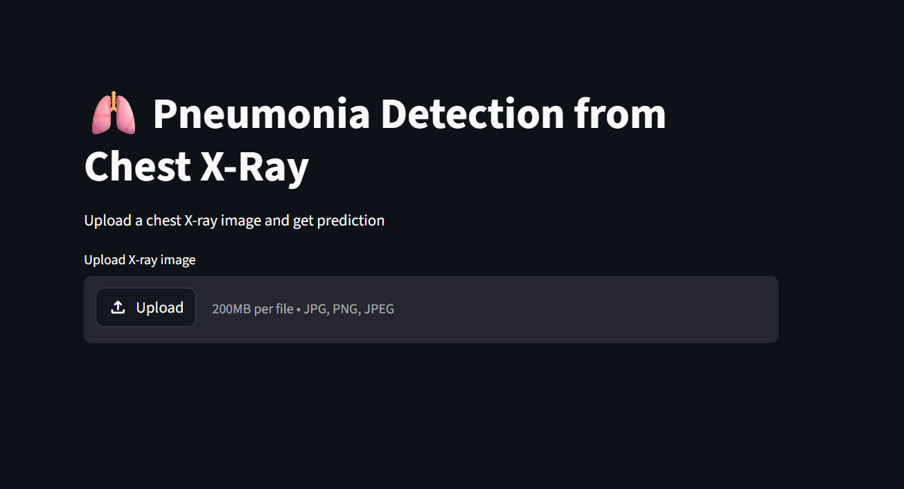

# 🫁 Pneumonia Detection from Chest X-ray

An end-to-end deep learning application for detecting **Pneumonia** from chest X-ray images using a fine-tuned **ResNet18** model. The project demonstrates the complete machine learning workflow—from data preprocessing and model training to evaluation and deployment through a Streamlit web application.

---

## 📌 Overview

Pneumonia is a potentially life-threatening lung infection where early diagnosis is critical. This project leverages **transfer learning** to classify chest X-ray images into one of two categories:

* ✅ Normal
* 🦠 Pneumonia

The primary objective is to build an accurate and user-friendly diagnostic assistance tool while showcasing an end-to-end machine learning pipeline.

---

## ✨ Features

* Deep learning–based binary image classification
* Transfer learning with pretrained **ResNet18**
* Interactive web interface built with **Streamlit**
* Real-time inference on uploaded X-ray images
* Clean and modular project structure
* Easy-to-understand training and evaluation scripts

---

## 🧠 Model Architecture

* **Base Model:** ResNet18 (ImageNet pretrained)
* **Framework:** PyTorch
* **Transfer Learning:** Fine-tuned final classification layer
* **Output Classes:** Normal, Pneumonia
* **Loss Function:** CrossEntropyLoss
* **Optimizer:** Adam

---

## 📊 Model Performance

| Metric           | Score |
| ---------------- | ----: |
| Accuracy         |  ~95% |
| Pneumonia Recall |  ~96% |
| False Negatives  |    32 |

> **Note:** In medical image classification, **Recall** is often more important than overall accuracy because missing a pneumonia case (false negative) can have serious clinical consequences.

---

## 🖥️ Application Preview

<p align="center">
  
</p>

---

## 📁 Project Structure

```text
pneumonia-detection/
│
├── app.py                  # Streamlit application
├── src/
│   ├── data_loader.py
│   ├── model.py
│   ├── train.py
│   └── evaluate.py
│
├── requirements.txt
├── README.md
└── screenshot.png
```

---

## ⚙️ Installation

Clone the repository:

```bash
git clone https://github.com/Abhhiiissshhek/pneumonia-detection.git
cd pneumonia-detection
```

Create a virtual environment (recommended):

```bash
python -m venv .venv
```

Activate the environment:

### Windows

```bash
.venv\Scripts\activate
```

### Linux / macOS

```bash
source .venv/bin/activate
```

Install dependencies:

```bash
pip install -r requirements.txt
```

Run the application:

```bash
streamlit run app.py
```

---

## 📂 Dataset

This project uses the **Chest X-ray Pneumonia Dataset** available on Kaggle.

> The dataset is not included in this repository due to its size and licensing restrictions.

---

## 🚀 Training

To train the model from scratch or fine-tune the network:

```bash
python src/train.py
```

After training, save the model weights and use them with the Streamlit application for inference.

---

## 📈 Evaluation

Model evaluation includes:

* Accuracy
* Recall
* Confusion Matrix
* Classification Metrics

The evaluation script can be executed using:

```bash
python src/evaluate.py
```

---

## ⚠️ Repository Notes

* The trained `.pth` model file is **not included** because it exceeds GitHub's file size limit.
* You can reproduce the model by training it using the provided scripts.

---

## 🔮 Future Improvements

* Confidence score for predictions
* Grad-CAM visualizations for model explainability
* Docker support
* Cloud deployment
* Model comparison (ResNet, EfficientNet, DenseNet)
* Improved recall with advanced augmentation techniques
* Continuous Integration (GitHub Actions)

---

## 🛠️ Tech Stack

* Python
* PyTorch
* TorchVision
* Streamlit
* NumPy
* Pillow
* Matplotlib

---

## 📚 Key Learnings

Through this project, I gained hands-on experience with:

* Transfer Learning
* Medical Image Classification
* Deep Learning using PyTorch
* Model Evaluation and Performance Analysis
* Building production-ready ML applications with Streamlit
* End-to-end machine learning workflows

---

## 👨‍💻 Author

**Abhishek Prajapati**

* GitHub: https://github.com/Abhhiiissshhek
* LinkedIn: https://www.linkedin.com/in/abhishekprajapati-ml

---

## ⭐ Support

If you found this project useful, consider giving the repository a **star**. Feedback, suggestions, and contributions are always welcome.
